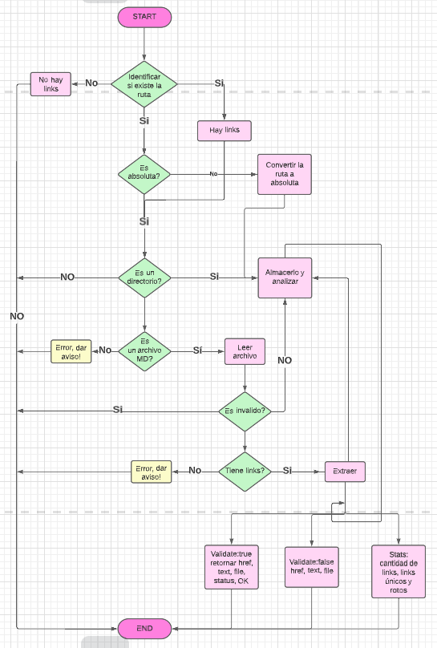
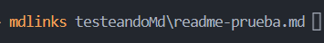

# Markdown-Links

## Índice

- [1. Descripción](#1-descripción)
- [2. Diagrama de Flujo](#2-diagrama-de-flujo)
- [3. Instalación](#3-instalación)
- [4. Ejemplos de uso](#4-ejemplos-de-uso)

---

## 1. Descripción

MD-Links es una librería creada en Node.Js con la función de leer un archivo markdown, o los archivos markdown encontrados en un directorio, extraer los links de estos y validar el estatus de cada uno. Como resultado nos puede entregar distintas estadísticas o información según el comando utilizado.

## 2. Diagrama de Flujo

Diagrama usado para guiar y desarrollar la lógica del proyecto:

## 3. Instalación

Para instalar la librería:

`npm i md-links-franda`

## 4. Ejemplos de uso

Una vez instalada la librería, puedes ejecutarla con el comando 'mdlinks' en tu terminal, agregando también la ubicación de tu archivo, para verificar si es absoluta:

